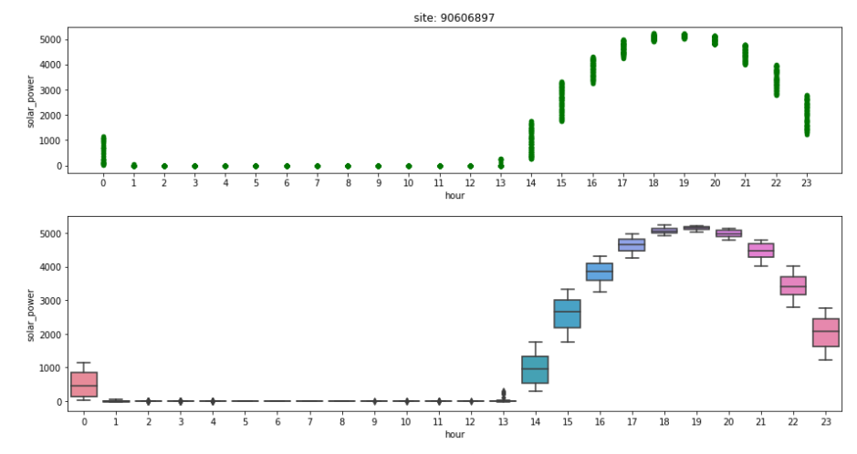
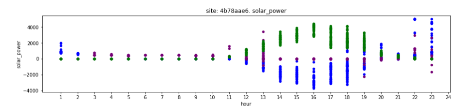
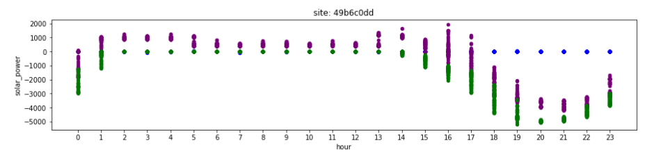
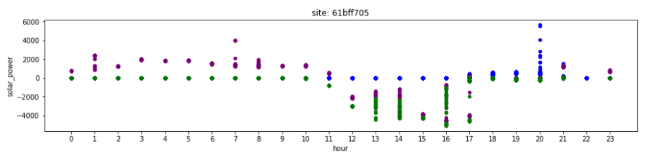
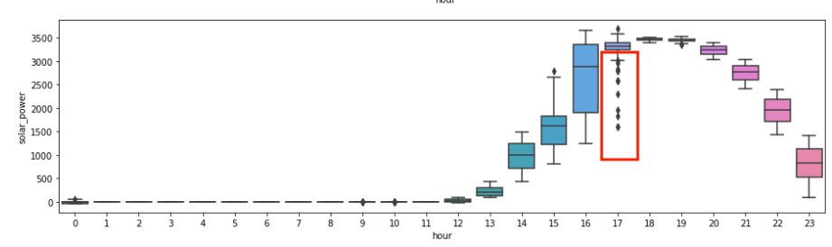
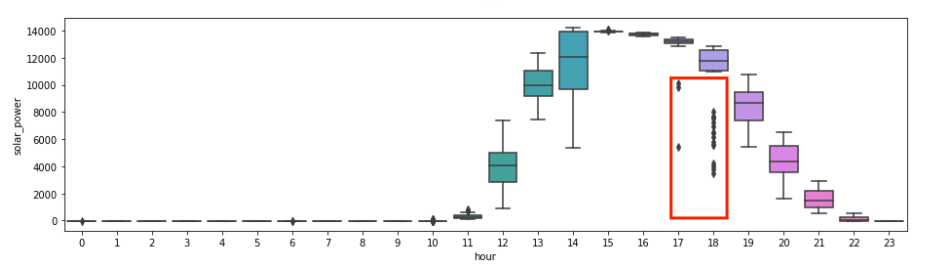
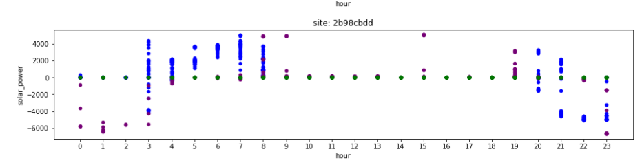
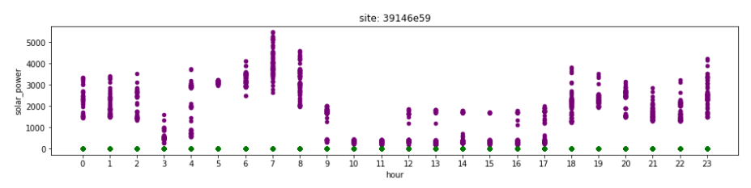
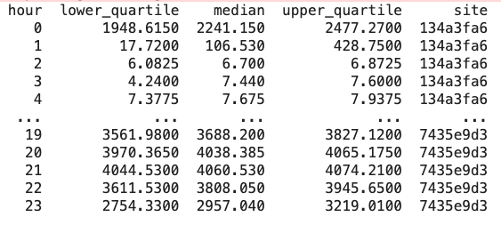

# **Tesla Energy Data Test**

## Introduction

This exercise is to run a python program to collect simulated data and 
provide analysis for three types of data: have 3 signals from a simple system where a battery charges from excess solar and discharges at night to reduce amount of energy coming from the grid.

The Rest APIs provided by Tesla is documented in https://te-data-test.herokuapp.com/

## ETL pipeline
- Run : python3 data_loader.py
### Data extraction

- Invoke simulated Rest API provided by Tesla data test:

     a. Retrieve sites info 
     
     b. Retrieve signals info with each site id from #a
     
     c. Convert signal json result to python dictionary object with site id 
     
     d. Exception handling: Need to handle connection exceptions so the load can continue running even connection exceptions happen.
     

### Data transformation

- Extracted data is normalized and flattened

- Removed unused columns and renamed column names for clearer reference

- Timestamp column is added based on date time string

## Data Loading

- Data is loaded into cvs file 

- Loader had been running for ~2 days and continuously appended into csv file. 

## Historical data analysis

- Run: jupyter notebook: history_data_view.ipynb

- Hourly boxplot and scatter plot time series charts are used for historical data analysis for each site. 

- Assumption: Note that it will be
ideal to have other data, like weather, temperature and raining to have better analysis, however we don't have these data available for this exercise. The assumption is 
to assume the weather fluctuate very little at each site.

- Historical data and anomaly analysis

    a. Sites without data: 2b33a48d, 90791ae9
    
    b. Solar data pattern: Solar power should be greater than 0, the solar power increases during th day time and decreases 
        approaching night. The power becomes 0 during the night. The following is hourly scatter and boxplot charts for site 90606897
             
   
   
    c. Power data pattern: If we view all three types of power data in scatter chart, we can find a patter:
     The battery power (blue) is charging (negative) during the day time and discharging (positive) during the night (until no more battery). The site/grid
     power ( purple) kicks in when there is no solor or battery power. Site/grid power is used during the later night hours.
     
     
    
    d. Sites without solar data: 2b33a48d, 90791ae9
    
    e. Sites with negative solar data: 61bff705, 49b6c0dd
    
    
    
    
    
    f. Sites with anomaly data, we can use boxplot to see the outlier data : f7f9ac09, f34b386a
    
    
    
    

    g. Sites do not seem to have solar power: 2b98cbdd, 3914e59. The second one does not seem to have
    battery power, either.
    
    
    
    

## Realtime anomaly analysis

- Run: python3 anomaly_detector.py

- Boxplot's statistics is extracted for simple anomaly analysis

- The upper and lower quartile values per site and per hour is used to decide if new data is potential outlier

- Note I only collected 2 days' data, ideally, much more data is needed for better anomaly detection

- The output will show the anomaly, e.g.:

*** Site: f34b386a, date= 2021-07-04 18:12:44+00:00, hour= 18, solar= 12620.79 has anomaly detected

===> lower= 11073.5725, upper= 12594.880000000001

*** Site: 5fc96249, date= 2021-07-04 18:12:45+00:00, hour= 18, solar= 7575.57 has anomaly detected

===> lower= 7552.712500000001, upper= 7573.4325

*** Site: 82c74b9e, date= 2021-07-04 18:12:45+00:00, hour= 18, solar= 3113.66 has anomaly detected

===> lower= 3115.965, upper= 3211.7725

## Sample raw data

- Sites and signal data is collected with provided Rest APIs and token over ~2 days. The **raw_data.csv** contains the sample raw data.

